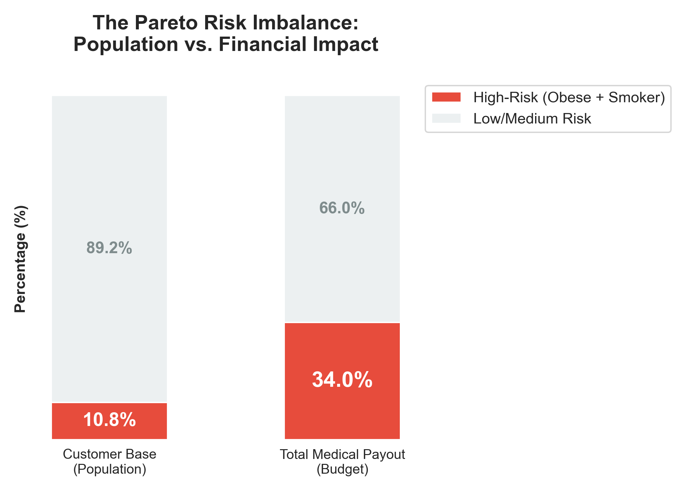
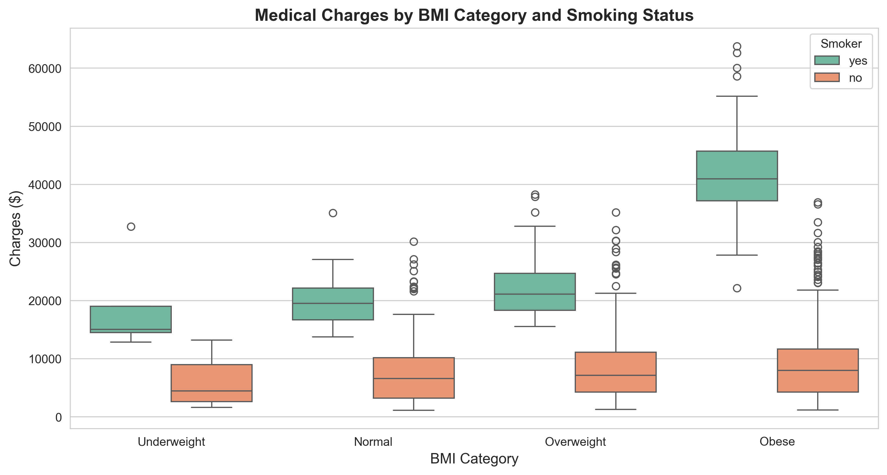
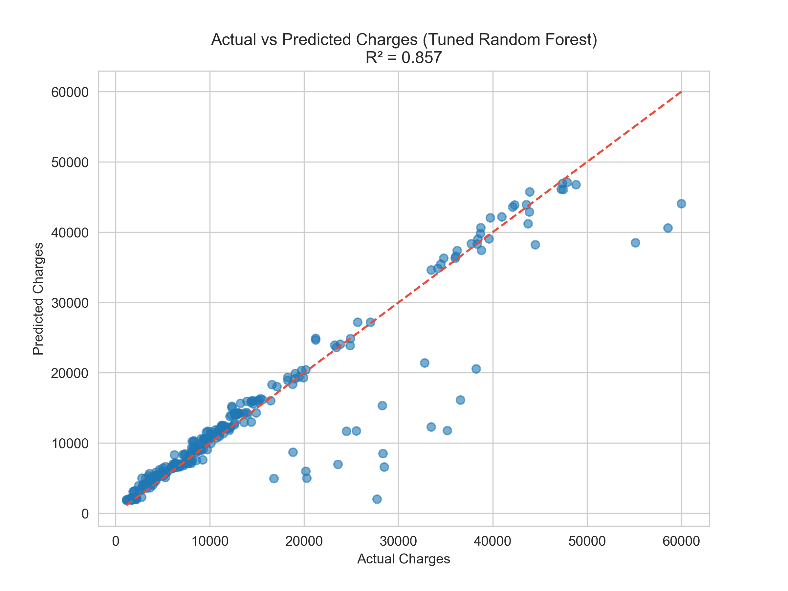
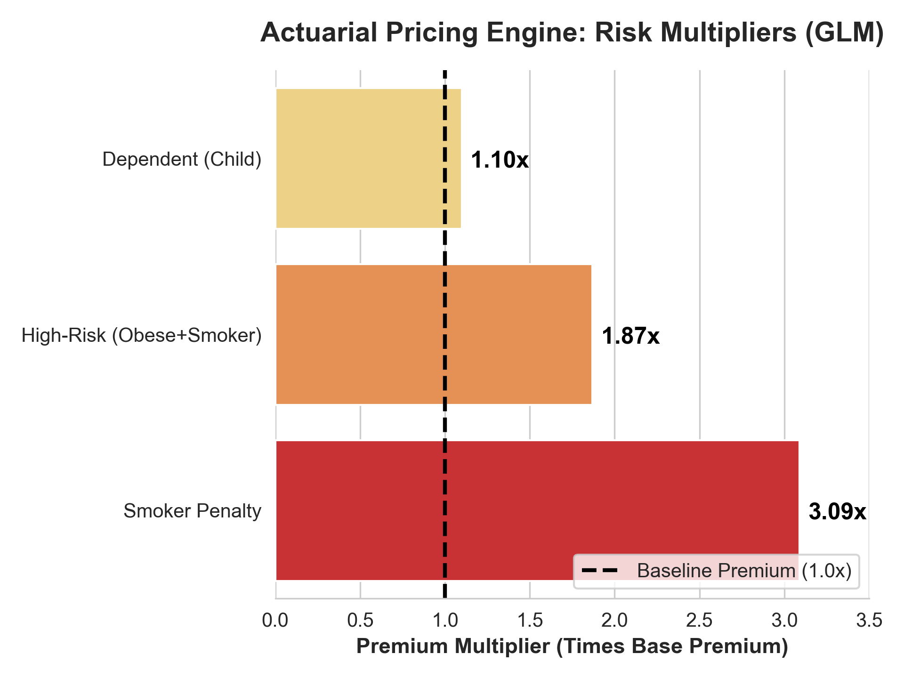

# Insurance Risk Segmentation & Pricing Optimization

> An end-to-end analytical project that identifies high-cost customer segments in a health insurance portfolio and translates findings into a deployable, risk-based pricing framework.

**Key insight:** 10.8% of policyholders generate 34.0% of total medical charges — a structural Pareto imbalance that current pricing fails to capture.

---

## 📌 Business Problem

Insurance providers must balance competitive pricing with sustainable portfolio profitability. When higher-risk customers are underpriced, or lower-risk customers are over-discounted, the business experiences margin leakage and unfavorable portfolio mix.

This project addresses five core business questions:

1. Which customer segments generate disproportionately high medical charges?
2. Which observable risk factors are most strongly associated with cost?
3. Which profiles justify differentiated pricing or stricter underwriting?
4. Is the current No-Claims Bonus structure aligned with observed risk?
5. Which segments are most attractive for sustainable portfolio growth?

---

## 🎯 Key Findings

### 1. Risk Concentration: The Pareto Imbalance

**10.8% of policyholders generate 34% of total medical charges.**

This is the single most important finding of the analysis. A small, identifiable segment of the portfolio drives disproportionate cost — meaning targeted pricing adjustments to this group can deliver outsized financial impact without affecting the broader customer base.

*Figure 1: Population share vs. total medical cost share by risk tier.*

---

### 2. Smoking × Obesity: The Hidden Interaction Effect

**Smoker-obese policyholders cost $41,533 on average — 4.7x more than non-smoker obese individuals ($8,806).**

Obesity alone is not a strong cost driver. The real risk emerges from the **interaction** between smoking and obesity. This insight is invisible when each variable is analyzed in isolation, and it directly motivates the engineered `is_high_risk` feature used in modeling.

*Figure 2: Distribution of charges across BMI categories, separated by smoking status.*

---

### 3. Additional Statistically Validated Findings

| Finding | Evidence |
|---------|----------|
| **Smoking is the dominant cost driver** | Smokers incur 280% higher charges on average ($32,018 vs $8,415); *t* = 32.52, *p* < 0.001 |
| **No-Claims Bonus does not reflect risk** | All NCB coefficients statistically insignificant (*p* > 0.10) after controlling for risk factors |
| **Latent underpricing exposure** | ~$339K annualized unpriced risk in the high-risk segment |
| **Model performance** | Tuned Random Forest achieves R² = 0.857 on held-out test set |

---

## 🛠 Tech Stack

- **Data manipulation:** `pandas`, `numpy`
- **Visualization:** `matplotlib`, `seaborn`
- **Statistical testing:** `scipy`, `statsmodels` (t-test, ANOVA, Tukey HSD, GLM)
- **Machine learning:** `scikit-learn` (Random Forest, Gradient Boosting, Linear Regression)
- **Model interpretability:** `shap`
- **Data extraction:** SQL (PostgreSQL pipeline simulated via `sqlalchemy`)

---

## 📊 Methodology

The project follows a structured analytical pipeline:

1. **Data Extraction & Inspection** — SQL-style ETL workflow with quality checks
2. **Cleaning & Preparation** — standardization, missing value imputation, outlier review
3. **Feature Engineering** — `bmi_category`, `is_high_risk` (smoker × obese interaction)
4. **Exploratory Data Analysis** — distribution analysis, segment comparisons, interaction effects
5. **Hypothesis Testing** — t-test (smoking impact), ANOVA + Tukey HSD (BMI categories), multivariate regression (NCB validation)
6. **Predictive Modeling** — baseline comparison → cross-validation → hyperparameter tuning → final evaluation
7. **Model Interpretation** — SHAP analysis + residual diagnostics
8. **Pricing Engine (GLM)** — translation of insights into transparent premium multipliers
9. **Strategic Recommendations** — business-actionable conclusions

---

## 📈 Model Performance

| Model | MAE | RMSE | R² |
|-------|-----|------|------|
| Linear Regression | $4,089 | $8,257 | 0.571 |
| Random Forest (untuned) | $2,302 | $4,993 | 0.843 |
| Gradient Boosting | $2,246 | $4,934 | 0.847 |
| **Random Forest (tuned)** | **$2,011** | **$4,760** | **0.857** |

*Figure 3: Tuned Random Forest predictions vs. actual charges on the held-out test set.*

The tuned Random Forest serves as the predictive benchmark, while the GLM provides the interpretable pricing engine for business deployment.

---

## 🏗 Pricing Framework Output

The analysis produces a deployable three-tier pricing structure based on GLM multipliers:

| Tier | Profile | Premium Multiplier | Portfolio Share |
|------|---------|-------------------|-----------------|
| Standard | Non-smoker, BMI < 30 | 1.0x (baseline) | ~70% |
| Elevated | Smoker OR Obese | 1.5x – 3.1x | ~19% |
| High-Risk | Smoker AND Obese | 5.8x | ~11% |

**Base premium:** $2,082 (reference profile)

*Figure 4: Premium multipliers translated from GLM coefficients into actionable pricing factors.*

---

## 📁 Repository Structure
